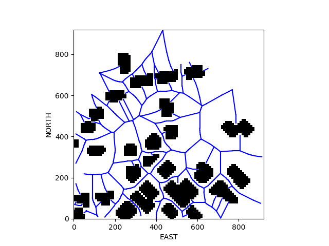

# Drone 3D Motion Plannning 

  
(this is a partial video, see Video.mp4 for full video)
 

## Objective 

- Create a path from one point to another point, and create the path in 3D environment (a virtual city)
- Move a virtual drone to move along the path between nodes (the node cloest to start point and the node closest to goal point)

## Approach

- Applied graph to simplifiied the 3D route into nodes and edges
    -  First consider the obstacles in specified attitude  
    -  Then made edge and nodes based on Voronoi algorithm (as shown below)

  

- Then applied A* search algorithm to create the optimal path 
- This uses [UdaciDrone API](https://udacity.github.io/udacidrone/) to control the drone

## Result

- The drone could smoothly moved to the specified point (see video 'video.mp4')
- The A* search route planning was quick when using the graph, completed within a second. This is opposite to using grid, that took minutes. 

## Further Improvements
- The micro routes between nodes are not always optimal, since nodes are located at the center between obstacles. To further opimize the route, smoothing should be considered. 

## How to run
- Download the Simulator [from this repository](https://github.com/udacity/FCND-Simulator-Releases/releases).
- Set up Conda envrionment seeing [this repository](https://github.com/udacity/FCND-Term1-Starter-Kit) and activate it ('source activate fcnd')
- Run the simulator and choose Motion Planning environment
- Run following `python motion_planning.py` 

